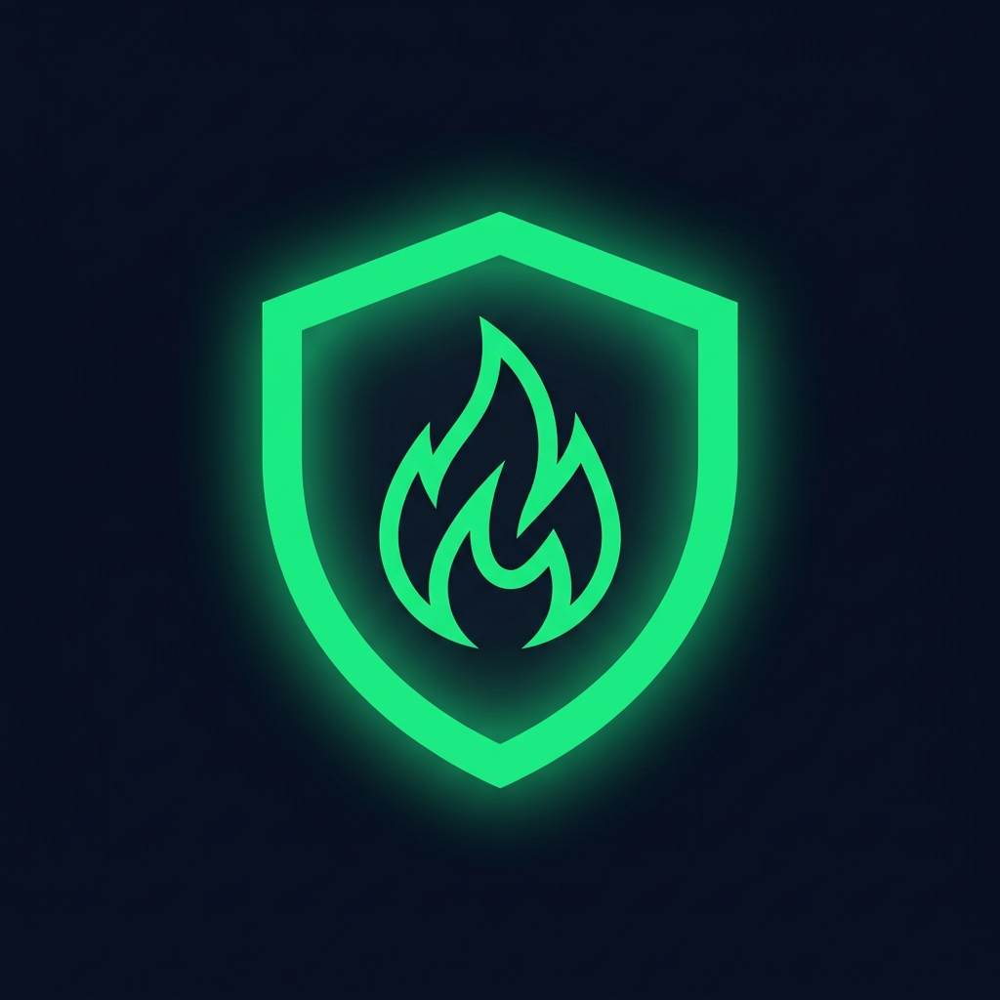

<div align="center">

# 🛡️ SafeCook Pro

### Smart Gas Stove Safety & Emergency Monitoring System

**An IoT-powered safety platform designed to detect gas leaks, monitor cooking conditions, and provide rapid emergency response — with accessibility at its core.**

<br>



<br><br>

**🚨 Gas Safety · 🏠 Smart Home · 👵 Accessibility · 🌐 Multilingual · 📊 Monitoring**

</div>

---

## 📖 Overview

**SafeCook Pro** is a smart kitchen safety system built around the **Smart-Valve Retrofit (SVR)** concept.

The system combines gas sensing, vessel detection, automated valve control, emergency alerts, and a user-friendly monitoring application to help reduce risks associated with gas leaks and unattended cooking.

A major design goal is **accessibility**. The interface is designed for users who may have difficulty with small text, complex navigation, or low-contrast interfaces.

### 🎯 Core Idea

> **Detect → Decide → Alert → Act**

SafeCook Pro continuously monitors the cooking environment and can trigger an emergency response when a dangerous condition is detected.

---

## 🚨 The Problem

Traditional gas stoves generally depend heavily on users noticing unsafe conditions themselves.

Common risks include:

* 🔥 Gas leaks
* 🍳 Unattended cooking
* 🫕 Cookware being removed while the burner remains active
* 🚨 Delayed emergency response
* 👵 Difficult-to-use interfaces for elderly users
* 🌐 Limited accessibility and language options

SafeCook Pro aims to provide an additional layer of monitoring and automated response.

---

## 💡 The Solution

SafeCook Pro combines a retrofit hardware concept with a software monitoring platform.

### Smart-Valve Retrofit

The SVR concept is designed to work alongside an existing domestic gas stove rather than requiring complete stove replacement.

The system can integrate:

* Gas sensors
* Ultrasonic vessel detection
* Temperature/environment monitoring
* ESP32-based processing
* Motorized valve control
* Local alarms
* Mobile/web monitoring
* Emergency notifications

---

# ✨ Key Features

| Feature                     | Description                                                                        |
| --------------------------- | ---------------------------------------------------------------------------------- |
| 🛡️ **Gas Leak Monitoring** | Monitors gas sensor readings and raises safety alerts                              |
| 🫕 **Vessel Detection**     | Detects whether cookware is present on the cooking area                            |
| 🔒 **Valve Control**        | Supports automated and manual valve-control workflows                              |
| 🚨 **Emergency Mode**       | Provides a dedicated emergency interface and safety guidance                       |
| 📊 **Live Monitoring**      | Displays sensor telemetry and historical information                               |
| 👵 **Elderly-Friendly UI**  | Large touch targets, readable typography, high contrast and accessibility controls |
| 🌐 **Multilingual Support** | English, Tamil, Hindi, Telugu, Kannada and Malayalam                               |
| 👥 **Family Access**        | Supports different family-member access roles                                      |
| 📱 **PWA Support**          | Web application can be installed as a Progressive Web App                          |
| 🤖 **Android Companion**    | Native Android application source is included in the project                       |
| 🔔 **Emergency Alerts**     | Designed for rapid notification during critical conditions                         |
| 📈 **Analytics**            | Safety metrics, cooking activity and historical monitoring                         |

---

## 📸 Screenshots

### 🏠 Dashboard


### 📊 Live Monitoring


### 🚨 Emergency Mode


### 🍳 Recipes


### 📈 Analytics


### ⚙️ Accessibility & Settings


### 🌐 Language Selection


> **Tip:** Replace the placeholder screenshots above with screenshots from your actual application.

---

# 🏗️ System Architecture

```text
                 ┌──────────────────────┐
                 │    Gas Sensor        │
                 │      MQ-6            │
                 └──────────┬───────────┘
                            │
                 ┌──────────▼───────────┐
                 │  Ultrasonic Sensor   │
                 │  Vessel Detection    │
                 └──────────┬───────────┘
                            │
                            ▼
                 ┌──────────────────────┐
                 │        ESP32         │
                 │  Safety Controller   │
                 └───────┬───────┬──────┘
                         │       │
                  Sensor Data   Relay
                         │       │
                         ▼       ▼
              ┌──────────────┐  ┌─────────────────┐
              │ MQTT / Cloud │  │ Motorized Valve │
              │ Communication│  │   Controller    │
              └───────┬──────┘  └─────────────────┘
                      │
                      ▼
             ┌────────────────────┐
             │  SafeCook Backend  │
             │  Node.js + SQLite  │
             └─────────┬──────────┘
                       │
                       ▼
             ┌────────────────────┐
             │   SafeCook Pro     │
             │   Web / PWA App    │
             └─────────┬──────────┘
                       │
                       ▼
             ┌────────────────────┐
             │  User / Family     │
             │ Monitoring & Alerts│
             └────────────────────┘
```

---

# 🧩 Technology Stack

### Frontend

* HTML5
* CSS3
* Vanilla JavaScript
* Modular JavaScript architecture
* Responsive UI
* Progressive Web App support
* Custom design system
* Canvas-based telemetry charts

### Backend

* Node.js
* HTTP server
* SQLite
* Environment-based configuration

### IoT / Hardware

* ESP32
* MQ-series gas sensing
* Ultrasonic vessel detection
* Temperature/environment monitoring
* Relay-controlled valve concept
* MQTT communication

### Mobile

* Android
* Kotlin
* Jetpack Compose

### Accessibility

* High-contrast interface
* Adjustable font sizes
* Large touch targets
* Voice announcements
* Multilingual interface
* Simplified navigation

---

# 🌐 Supported Languages

SafeCook Pro currently includes a multilingual architecture supporting:

🇬🇧 English
🇮🇳 Tamil
🇮🇳 Hindi
🇮🇳 Telugu
🇮🇳 Kannada
🇮🇳 Malayalam

The translation system is implemented through the project's internationalization module.

---

# 📁 Project Structure

```text
SafeCook-PRO/
│
├── android/                    # Android application
│
├── css/                        # Application styles
│   ├── design-system.css
│   ├── components.css
│   ├── screens.css
│   └── animations.css
│
├── js/                         # Application JavaScript
│   ├── app.js
│   ├── state.js
│   ├── router.js
│   ├── i18n.js
│   ├── components.js
│   ├── charts.js
│   ├── mock-data.js
│   └── screens/
│
├── docs/                       # Documentation and screenshots
│   └── screenshots/
│
├── index.html                  # Main web application
├── server.js                   # Node.js backend
├── sw.js                       # PWA service worker
├── manifest.json               # PWA manifest
├── package.json                # Project configuration
├── .env.example                # Environment template
├── .gitignore                  # Git ignore rules
├── LICENSE                     # MIT License
└── README.md                   # Project documentation
```

---

# 🚀 Installation

## Prerequisites

Make sure you have:

* **Node.js 18+**
* **npm 9+**
* Git

## 1. Clone the repository

Copy the HTTPS repository address from the GitHub **Code** button and run:

```bash
git clone <YOUR-REPOSITORY-URL>
cd SafeCook-PRO
```

## 2. Install dependencies

```bash
npm install
```

## 3. Configure environment variables

Create your local environment file from the provided template.

```bash
cp .env.example .env
```

On Windows PowerShell, you can use:

```powershell
Copy-Item .env.example .env
```

Then open `.env` and configure the required values.

**Never commit your `.env` file to GitHub.**

## 4. Run the project checks

```bash
npm run check
```

## 5. Start the application

```bash
npm start
```

Then open:

```text
http://localhost:8080
```

in your browser.

---

# ⚙️ Environment Configuration

The project uses environment variables for configuration.

| Variable              | Purpose                     | Example               |
| --------------------- | --------------------------- | --------------------- |
| `PORT`                | Local server port           | `8080`                |
| `NODE_ENV`            | Application environment     | `development`         |
| `DATABASE_PATH`       | SQLite database location    | `./safecook.db`       |
| `MQTT_BROKER_URL`     | MQTT broker endpoint        | Your broker URL       |
| `FIREBASE_PROJECT_ID` | Firebase project identifier | Your Firebase project |

See `.env.example` for the configuration template.

---

# 📊 Development Status

| Component                      | Status                |
| ------------------------------ | --------------------- |
| Web UI                         | 🟢 Active development |
| Responsive Design              | 🟢 Implemented        |
| Accessibility Features         | 🟢 Implemented        |
| Multilingual UI                | 🟢 Implemented        |
| PWA Support                    | 🟢 Implemented        |
| Node.js Backend                | 🟢 Implemented        |
| SQLite Storage                 | 🟢 Implemented        |
| Telemetry Simulation           | 🟢 Implemented        |
| ESP32 Hardware Integration     | 🟡 In Progress        |
| Cloud Synchronization          | 🟡 In Progress        |
| Android Application            | 🟡 In Progress        |
| Production Hardware Validation | 🔴 Pending            |

---

# 🗺️ Roadmap

* [x] Build initial UI/UX system
* [x] Implement responsive interface
* [x] Add elderly-friendly accessibility controls
* [x] Add multilingual architecture
* [x] Implement Node.js backend
* [x] Add SQLite local storage
* [x] Add telemetry visualization
* [ ] Complete ESP32-S3 hardware integration
* [ ] Connect physical gas sensor hardware
* [ ] Complete MQTT communication
* [ ] Complete cloud synchronization
* [ ] Finalize Android application
* [ ] Conduct hardware safety testing
* [ ] Perform field testing
* [ ] Complete applicable regulatory/certification work

---

# 🔐 Security

SafeCook Pro is designed with security-conscious development practices.

### Current protections

* Sensitive environment files excluded through `.gitignore`
* Environment variables used for configurable secrets
* Local database excluded from version control
* Dependency/build artifacts excluded from Git
* No credentials should be hard-coded into the source code

### ⚠️ Never commit

```text
.env
*.key
*.pem
credentials.json
private configuration files
local databases containing sensitive user information
```

If a secret is accidentally committed, **rotate/revoke it immediately** rather than simply deleting the file from the latest commit.

---

# 🧪 Testing & Validation

The project includes code-integrity checks through the npm scripts defined in `package.json`.

Before submitting changes:

```bash
npm run check
```

For hardware integration, additional validation should include:

* Sensor accuracy testing
* False-positive/false-negative analysis
* Valve response testing
* Communication failure testing
* Power failure testing
* Emergency notification testing
* Environmental testing
* Hardware reliability testing
* Formal safety validation

---

# 🤝 Contributing

Contributions are welcome.

A typical contribution workflow:

```text
Fork
  ↓
Create a feature branch
  ↓
Make your changes
  ↓
Run tests/checks
  ↓
Commit your changes
  ↓
Open a Pull Request
```

Please keep pull requests focused and provide a clear description of the changes.

---

# 📜 License

SafeCook Pro is released under the **MIT License**.

See `LICENSE` for the complete license text.

---

# ⚠️ Safety Disclaimer

> **IMPORTANT:** SafeCook Pro is currently a prototype/project implementation and must not be treated as a certified life-safety device or primary gas-protection system.
>
> Any real-world deployment involving gas appliances, automated valves, sensors, or emergency systems requires comprehensive engineering validation, hardware safety testing, failure-mode analysis, appropriate supervision, and applicable regulatory certification.
>
> Always follow the manufacturer's safety instructions and normal gas-safety practices.

---

# 🌟 Vision

SafeCook Pro aims to make kitchen safety **smarter, simpler and more accessible**.

The long-term vision is to combine:

**IoT + Automation + Accessibility + Multilingual Design + Safety Analytics**

into an affordable retrofit-oriented safety ecosystem that can help families monitor their cooking environment and respond faster to hazardous situations.

---

<div align="center">

### 🛡️ SafeCook Pro

**Smart safety for every kitchen.**

Built with ❤️ for safer and more accessible homes.

</div>
