# SafeCook Pro

**SafeCook Pro** is an intelligent IoT LPG gas-safety and monitoring application powered by the **Smart-Valve Retrofit (SVR)** system. Designed with a high-contrast, elderly-friendly user interface and multi-language support, SafeCook Pro detects hazardous gas leaks, monitors stove vessel placement, and automatically shuts off the gas supply before accidents happen.

---

## Problem

Domestic LPG gas leaks and un-attended cooking are leading causes of household fires, gas poisoning, and severe kitchen injuries across the globe—disproportionately affecting elderly individuals and busy families:
* **Gas Leaks**: MQ-series sensors detect unburnt LPG gas before human olfactory awareness.
* **Unattended Stove Risks**: Food left boiling over or vessels removed while flame stays active creates fire hazards.
* **Accessibility Gaps**: Standard IoT apps often feature tiny fonts and complex navigation, making them unusable for senior citizens.

---

## Solution

The **Smart-Valve Retrofit (SVR)** system attaches to existing domestic LPG gas regulators without requiring full stove replacement. Combined with the SafeCook Pro application, it offers:
* **Real-time LPG PPM Telemetry**: Continuous monitoring of ambient gas concentration and ambient temperature.
* **Ultrasonic Vessel Detection**: Detects whether cookware is present on the burner.
* **Motorized Solenoid Valve Control**: Automatic emergency shutdown within milliseconds of leak detection or when vessel is absent beyond 30 seconds.
* **Multi-Channel Emergency Alerts**: Local high-decibel buzzer, push notifications, voice announcements, and direct emergency contact speed-dial.

---

## Key Features

* 🛡️ **Gas Leak Detection**: Instant alert triggering when gas PPM exceeds safe thresholds (100 PPM Warning, 300 PPM Critical).
* 🫕 **Vessel Detection & Safety Timer**: Auto-shutoff countdown if a vessel is removed while the valve remains open.
* 🔒 **Automatic & Manual Valve Control**: 1-tap emergency shutoff with modal confirmation dialogs.
* 🚨 **Emergency Mode**: Dedicated ultra-high contrast emergency screen with emergency contact calling and step-by-step safety guides.
* 📊 **Live Telemetry & Analytics**: Real-time line charts, daily cooking time metrics, and monthly safety score reports.
* 👵 **Elderly-Friendly Interface**: High contrast colors, font scaling (Normal / Large / Extra Large), large touch targets (≥48px), and text-to-speech voice announcements.
* 🌐 **Multi-Language Architecture**: 6 supported languages (**English**, **Tamil**, **Hindi**, **Telugu**, **Kannada**, **Malayalam**) with dynamic string updates.
* 👥 **Family Member Linkage**: Role-based access control (Owner, Family Member, Guest view-only).

---

## Screenshots & UI Showcase

### Dashboard & Control Center
| Home Dashboard | Controls & Telemetry | Quick Actions |
| :---: | :---: | :---: |
| [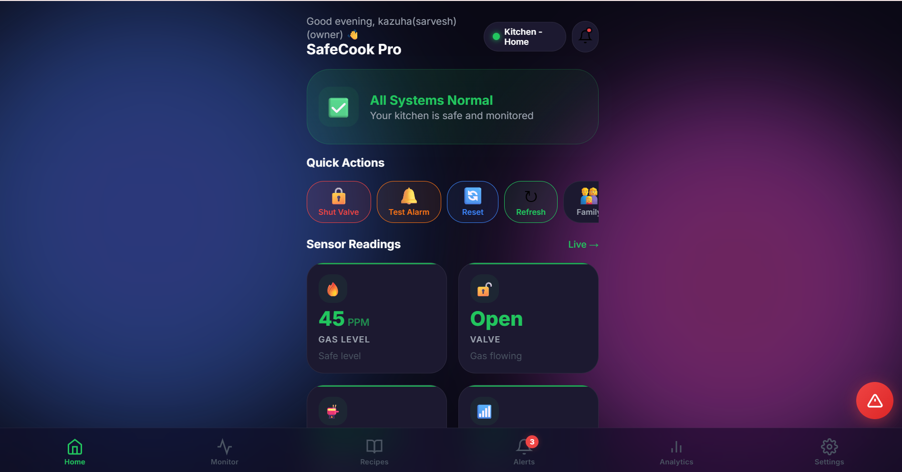](docs/screenshots/dashboard_1.png) | [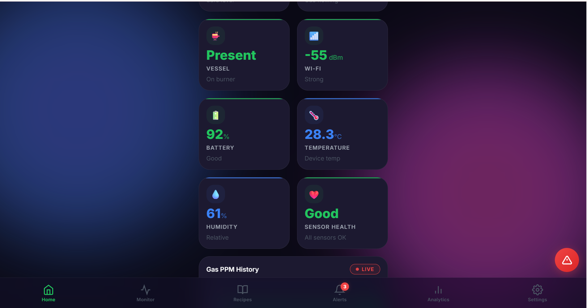](docs/screenshots/dashboard_2.png) | [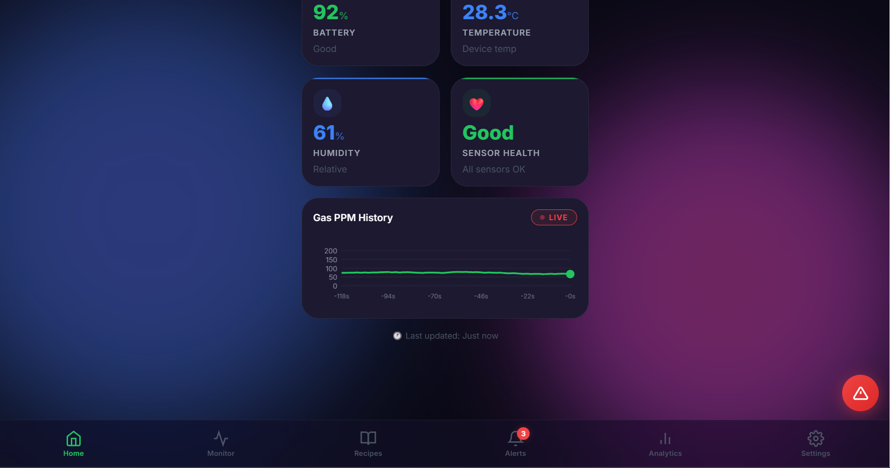](docs/screenshots/dashboard_3.png) |

### Real-Time Monitoring & Telemetry
| Live Sensor Stream | PPM Telemetry History | Range Selector |
| :---: | :---: | :---: |
| [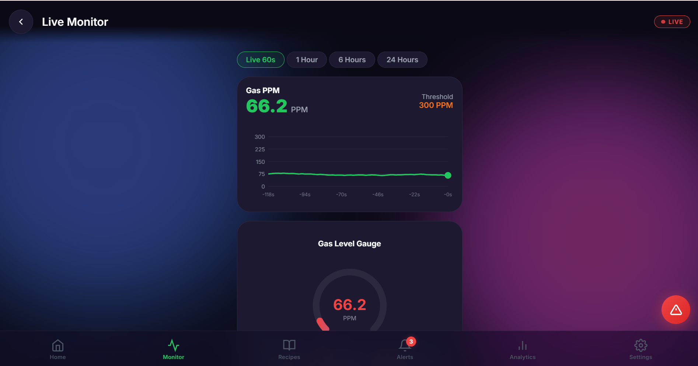](docs/screenshots/monitoring_1.png) | [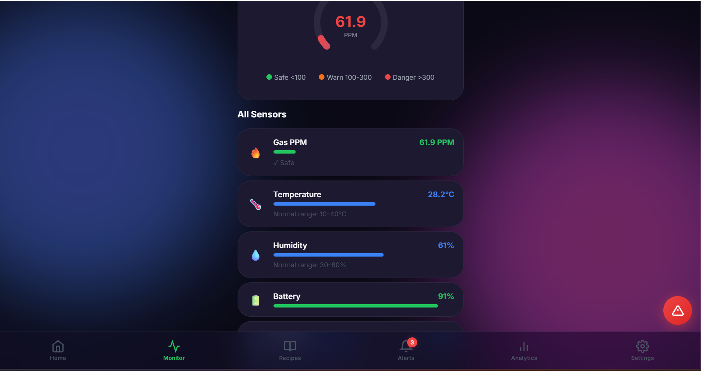](docs/screenshots/monitoring_2.png) | [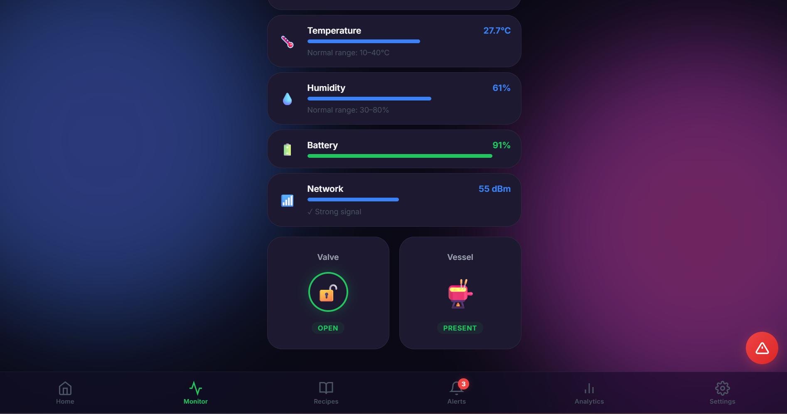](docs/screenshots/monitoring_3.png) |

### Emergency Alert Mode & Safety Guide
| Critical Gas Leak Alert | Safety Instructions Modal |
| :---: | :---: |
| [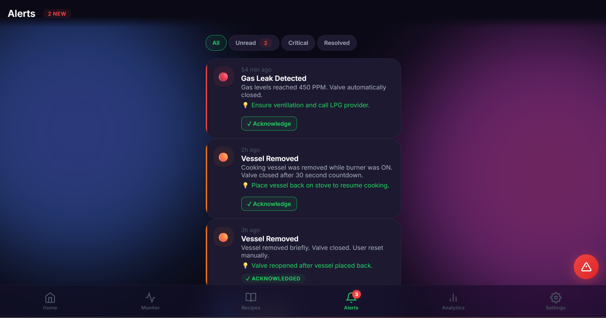](docs/screenshots/emergency_1.png) | [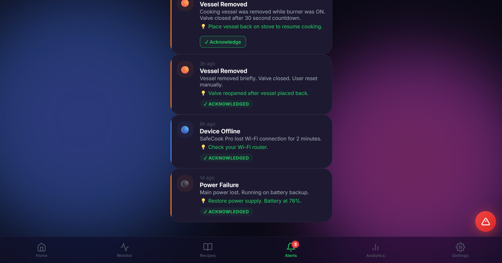](docs/screenshots/emergency_2.png) |

### Multi-Language & Accessibility
| Language Selection | Accessibility Settings | Profile & Account |
| :---: | :---: | :---: |
| [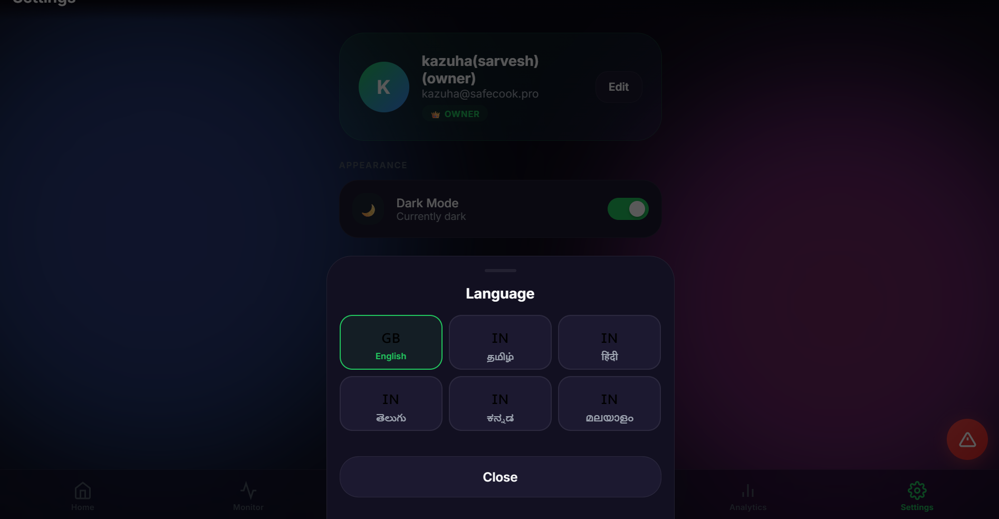](docs/screenshots/languages_1.png) | [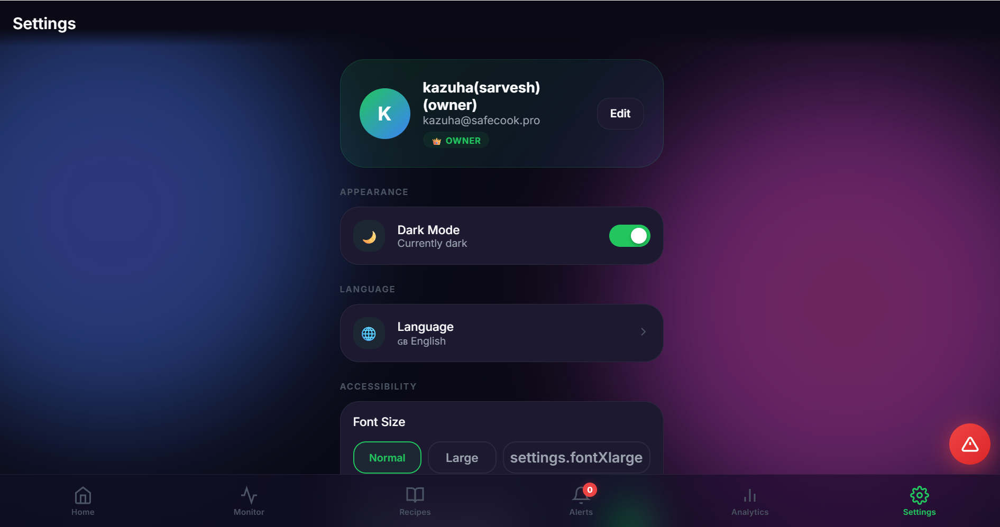](docs/screenshots/settings_1.png) | [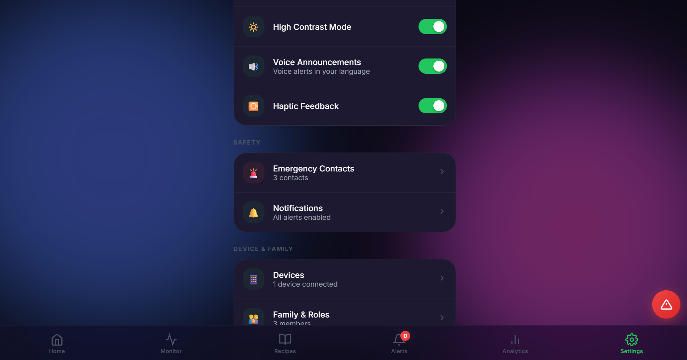](docs/screenshots/settings_2.png) |

### Analytics & Safe Cooking Assistant
| Safety Score Analytics | Consumption Metrics | Recipe Helper |
| :---: | :---: | :---: |
| [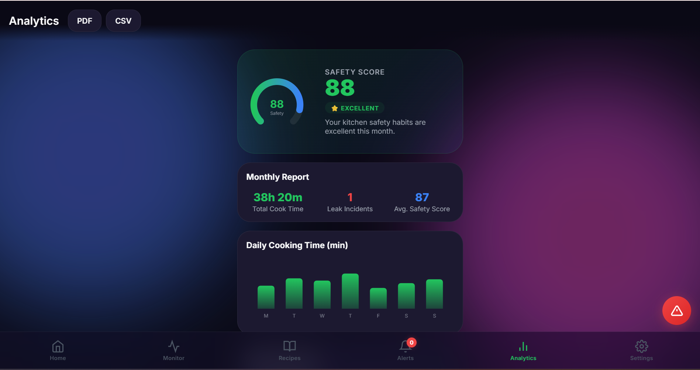](docs/screenshots/analytics_1.png) | [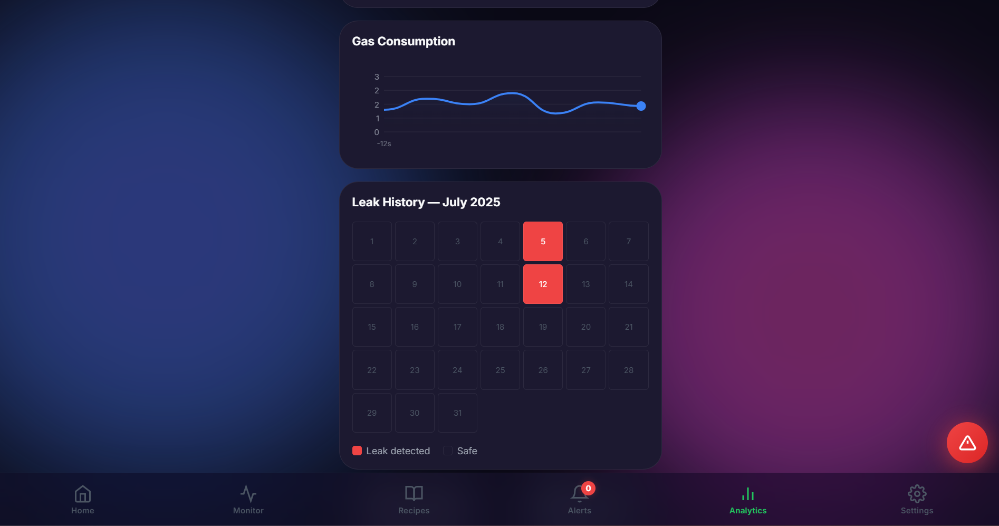](docs/screenshots/analytics_2.png) | [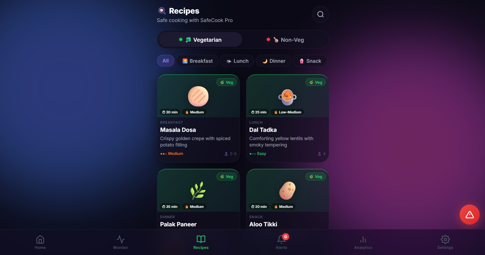](docs/screenshots/recipes_1.png) |

---

## System Architecture

```
[ MQ-6 Gas Sensor ] ──┐
[ Ultrasonic Sensor] ──┼──> [ ESP32 Microcontroller ] ──(MQTT / Firebase)──> [ SafeCook Pro Backend ]
[ Temp/Humidity   ] ──┘         │ (Local Relay Signal)                             │
                                ▼                                                  ▼
                        [ Solenoid Valve ]                              [ SafeCook Pro App ]
                                                                      (Web PWA & Android App)
```

### Component Status Matrix
| System Layer | Component | Status |
| :--- | :--- | :--- |
| **Sensors & Hardware** | MQ-6 LPG Gas Sensor, Ultrasonic Distance | Implemented (Simulated Telemetry in Preview) |
| **Microcontroller** | ESP32-S3 SVR Core Firmware | Planned / In Progress |
| **Actuator** | 12V Motorized Solenoid Valve Relay | Implemented (Software Trigger) |
| **Backend API** | Node.js HTTP Server (`server.js`) + SQLite | Implemented |
| **Cloud Sync** | Firebase Realtime Database & AWS IoT Broker | In Progress |
| **Web Frontend** | Vanilla JS / CSS3 PWA (`index.html`, `js/`) | ~75% Complete (Audited & Refactored) |
| **Android App** | Jetpack Compose Kotlin Native App (`android/`) | In Progress |

---

## Technology Stack

* **Frontend**: HTML5, Vanilla CSS3 (Custom Design System, Glassmorphism, CSS Variables), ES6+ Modular JavaScript.
* **PWA Support**: Service Worker (`sw.js`), Web App Manifest (`manifest.json`).
* **Backend Preview Server**: Node.js (`server.js`) using built-in `node:sqlite` database engine.
* **Database**: SQLite (`safecook.db`) storing sensor history, alerts, family profiles, emergency contacts, and recipes.
* **Mobile companion**: Native Android Application (`android/`) written in Kotlin with Jetpack Compose UI.
* **Internationalization**: Lightweight custom i18n engine (`js/i18n.js`) with 6 regional language dictionaries.

---

## Project Structure

```
safecook-pro/
├── index.html              # Main Web App entry point & bottom navigation layout
├── server.js                # Node.js backend preview server with SQLite database
├── tunnel.js                # Local tunnel utility for mobile preview testing
├── package.json             # Node dependencies and npm scripts
├── manifest.json            # Web App Manifest for PWA installation
├── sw.js                    # Service Worker for offline PWA caching
├── safecook.db              # Local SQLite database file (git-ignored)
├── .env.example             # Template for required environment variables
├── .gitignore               # Git ignore rules for node_modules, build artifacts, secrets
├── LICENSE                  # MIT Open Source License
├── css/
│   ├── design-system.css    # Core design tokens, color palettes, typography, spacing
│   ├── components.css       # Buttons, cards, modals, toggles, badges, toast notifications
│   ├── screens.css          # Screen layouts (Dashboard, Monitoring, Alerts, Emergency)
│   └── animations.css       # Micro-animations, pulses, emergency flashes
├── js/
│   ├── app.js               # Main application controller & event bus
│   ├── state.js             # Reactive central state management engine
│   ├── router.js            # Client-side hash-less single page router
│   ├── i18n.js              # Multi-language translation engine (EN, TA, HI, TE, KN, ML)
│   ├── components.js        # Dynamic HTML component templates
│   ├── charts.js            # Custom Canvas line chart generator for gas PPM monitoring
│   ├── mock-data.js         # Telemetry simulator & server database sync
│   └── screens/             # Modular screen view definitions
│       ├── splash.js        # App boot screen
│       ├── onboarding.js    # Slide carousel & language selector
│       ├── auth.js          # Login, Registration, OTP verification
│       ├── dashboard.js     # Solenoid valve control & main telemetry status
│       ├── monitoring.js    # Live telemetry graphs & history
│       ├── alerts.js        # Alert history & filter list
│       ├── analytics.js     # Safety score metrics & report exports
│       ├── devices.js       # SVR unit pairing, WiFi setup, diagnostics
│       ├── emergency.js     # Critical leak alert view & emergency contacts
│       ├── settings.js      # Accessibility & user preference settings
│       ├── family.js        # Family role management & member invitations
│       └── recipes.js       # Safe cooking assistant helper
└── android/                 # Native Android Jetpack Compose application source
```

---

## Setup & Local Development

### Prerequisites
* **Node.js**: v18.0.0 or higher
* **npm**: v9.0.0 or higher

### Installation Steps

1. **Clone the repository**:
   ```bash
   git clone https://github.com/your-username/safecook-pro.git
   cd safecook-pro
   ```

2. **Configure Environment Variables**:
   ```bash
   cp .env.example .env
   ```

3. **Check Code Integrity**:
   ```bash
   npm run check
   ```

4. **Start Local Server**:
   ```bash
   npm start
   ```
   Open `http://localhost:8080` in your web browser.

---

## Environment Variables

SafeCook Pro relies on the following environment variables (see `.env.example`):

| Variable | Description | Default / Example |
| :--- | :--- | :--- |
| `PORT` | Local preview server port | `8080` |
| `NODE_ENV` | Application environment | `development` |
| `DATABASE_PATH` | Path to SQLite database file | `./safecook.db` |
| `MQTT_BROKER_URL` | IoT MQTT Broker URI for ESP32 connection | `mqtts://broker.safecookpro.com:8883` |
| `FIREBASE_PROJECT_ID` | Cloud Firebase project identifier | `safecook-pro-dev` |

---

## Current Development Status

* 🟢 **Frontend Web Application**: ~75% complete (Fully responsive UI, PWA support, elderly accessibility controls).
* 🟡 **Backend Preview Server**: In progress (Local SQLite API operational; Cloud sync in development).
* 🟡 **ESP32 Firmware & Hardware Integration**: Planned / In progress (Local telemetry simulator active; hardware handshake ready).
* 🔴 **Production Field Testing & Certification**: Pending.

---

## Roadmap

- [x] Initial UI/UX prototype & design system
- [x] Elderly-friendly accessibility suite (Font scaling, high contrast, voice feedback)
- [x] Multi-language support for 6 Indian languages
- [x] Native Node.js backend server with SQLite storage
- [ ] Connect physical ESP32-S3 microcontroller with MQ-6 sensor over MQTT
- [ ] Integrate Firebase Cloud Messaging for instant push notification alerts
- [ ] Finalize Android Compose mobile client release build
- [ ] Conduct field testing and third-party safety validation

---

## Safety Disclaimer

> ⚠️ **IMPORTANT SAFETY NOTICE**: SafeCook Pro is currently a prototype/project implementation. It must NOT be treated as a certified life-safety device or primary gas protection system without comprehensive formal engineering validation, hardware safety testing, and official regulatory certification (such as CE, UL, or BIS certification). Always maintain manual gas safety precautions in your kitchen.
